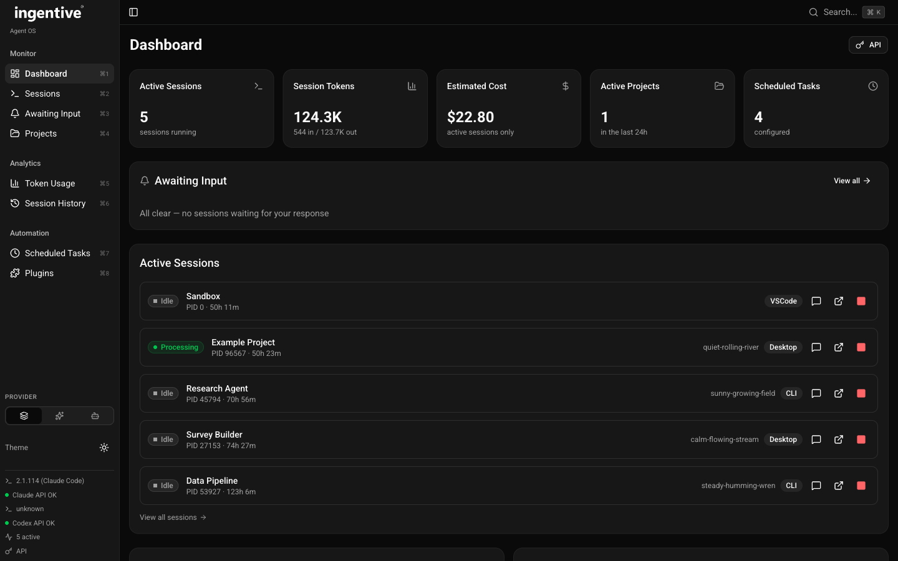

# Ingentive Agent OS

A local management dashboard for monitoring and interacting with your active **Claude Code** and **OpenAI Codex** sessions, projects, token usage, and scheduled tasks. Works on macOS, Windows, and Linux.



Ingentive Agent OS reads data directly from `~/.claude/` and `~/.codex/` on your filesystem — plus the Claude Desktop app storage — to give you real-time visibility into everything your AI coding agents are doing on your machine. Switch between providers with a single click, or view sessions from both side-by-side.

## Features

- **Multi-provider support** - Monitor Claude Code and OpenAI Codex sessions in one dashboard. A provider switcher in the sidebar filters every page to Claude, Codex, or both. Codex sessions are picked up whether they originate from the `codex` CLI, the Codex Desktop app, or the Codex VSCode extension
- **Dashboard** - Overview of active sessions, token usage, estimated costs, active projects, scheduled tasks, and a token usage chart
- **Sessions** - Live session list with status indicators (running, processing, idle, awaiting input), PID, duration, and entrypoint (CLI / Desktop / VSCode)
- **Awaiting Input** - Sessions where your agent is waiting for your response (including Codex `request_user_input` prompts), with configurable browser notifications
- **Session History** - Full history of all sessions (active and dead) with expandable conversation preview and error surfacing, for both providers
- **Projects** - All projects with session counts, last activity, token summaries, and cost estimates. Sort by name, activity, tokens, cost, or sessions. Group by parent directory
- **Project Detail** - Per-project view with session history, token usage charts, subagents, and memory files
- **Token Usage** - Stacked charts showing input/output/cache token breakdown per project, with per-provider pricing (Claude Sonnet 4 vs. GPT-5.3-codex)
- **Scheduled Tasks** - All scheduled tasks grouped by project, pulled from Claude Desktop
- **Global Search** - Search across projects, sessions, and conversations with Cmd/Ctrl+K
- **Cost Tracking** - Estimated USD costs based on each provider's API pricing, with an API/Subscription toggle to hide costs for subscription users
- **Session Interaction** - Click any session to open it directly in your terminal via `claude -r` or `codex --resume`
- **Conversation Viewer** - Inline viewer that renders both Claude's tool-use blocks and Codex's output messages, with correct speaker labels
- **System Status** - Live API health indicators for both Claude (status.anthropic.com) and Codex (status.openai.com), plus CLI versions
- **Dark/Light Mode** - Full theme support with the Ingentive brand

## Tech Stack

- Next.js 16 (App Router) + TypeScript
- shadcn/ui v4 + Tailwind CSS v4
- Recharts for token usage charts
- SWR for client-side polling (5s refresh)
- better-sqlite3 for reading Codex's local SQLite state
- next-themes for dark/light mode
- Vitest + Testing Library for unit tests
- Playwright for end-to-end tests

## Prerequisites

- Node.js 18+
- npm
- At least one of: Claude Code / Claude Desktop, or OpenAI Codex CLI / Codex Desktop / Codex VSCode extension

You don't need both providers installed — the dashboard detects what's available and shows whichever sessions exist. If neither directory is present, it starts with an empty state.

## Platform Support

Ingentive Agent OS supports macOS, Windows, and Linux. Session data is read from platform-appropriate locations, and clicking a session opens it in the native terminal for each OS.

| Platform | Claude data directory | Codex data directory | Terminal |
|----------|----------------------|---------------------|----------|
| macOS | `~/.claude/` | `~/.codex/` | Terminal.app |
| Windows | `%USERPROFILE%\.claude\` | `%USERPROFILE%\.codex\` | cmd.exe |
| Linux | `~/.claude/` | `~/.codex/` | gnome-terminal, konsole, or xterm |

Claude Desktop app data is additionally read from `~/Library/Application Support/Claude/` on macOS, `%APPDATA%\Claude\` on Windows, and `$XDG_CONFIG_HOME/Claude/` (default `~/.config/Claude/`) on Linux.

## Getting Started

### Install dependencies

```bash
cd ingentive-agent-os
npm install
```

### Build and run in production mode

```bash
npm run build
npm start
```

The app will be available at [http://localhost:3000](http://localhost:3000).

### Run in development mode (with hot reload)

```bash
npm run dev
```

## Testing

### Unit Tests

Unit tests use [Vitest](https://vitest.dev/) with [Testing Library](https://testing-library.com/) and jsdom. Tests cover utility functions, hooks, middleware security, CSV export, and component rendering.

```bash
# Run unit tests once
npm run test:unit

# Run in watch mode during development
npm run test:unit:watch
```

### End-to-End Tests

E2E tests use [Playwright](https://playwright.dev/) against a production build. They cover page navigation, dashboard rendering, accessibility landmarks, and theme toggling.

```bash
# Install Playwright browsers (first time only)
npx playwright install --with-deps chromium

# Run e2e tests (auto-builds and starts the app)
npm run test:e2e

# Run with interactive UI
npm run test:e2e:ui
```

### Run All Tests

```bash
npm test
```

### CI

A GitHub Actions workflow (`.github/workflows/test.yml`) runs on every pull request and push to main:

- **Unit Tests** — `npm run test:unit`
- **E2E Tests** — Playwright with Chromium, uploads HTML report as artifact
- **Lint & Type Check** — ESLint + `tsc --noEmit`

## Data Sources

All data is read server-side from the local filesystem. No external APIs or databases are required (except opt-in public status page checks at `status.anthropic.com` and `status.openai.com`).

### Claude

| Source | Location | Data |
|--------|----------|------|
| Sessions | `~/.claude/sessions/*.json` | Active session PIDs, working directories, entrypoints |
| Conversations | `~/.claude/projects/<encoded-path>/*.jsonl` | Token usage, session status, message history |
| Subagents | `~/.claude/projects/.../subagents/agent-*.meta.json` | Agent types and descriptions |
| Scheduled Tasks | `<app-data-dir>/local-agent-mode-sessions/**/scheduled-tasks.json` | Task definitions, schedules, last run times |
| Task Definitions | Referenced via `filePath` in scheduled-tasks.json | Task descriptions and prompts |

### Codex

| Source | Location | Data |
|--------|----------|------|
| Threads | `~/.codex/state_5.sqlite` (`threads` table, read-only) | Session IDs, cwd, source (cli/vscode/desktop), token counts, archived state |
| Conversations | Path in `threads.rollout_path`, typically `~/.codex/sessions/YYYY/MM/DD/*.jsonl` | `event_msg` / `response_item` entries, user input requests, tool calls |
| Subagents | `~/.codex/state_5.sqlite` (`thread_spawn_edges` table) | Parent/child thread relationships |
| Skills | `~/.codex/skills/*.md` | Installed Codex skills |

Codex does not expose a native scheduled-tasks concept, so the Scheduled Tasks view is Claude-only.

## Session Status Detection

Session status is determined by reading the last meaningful entry in each session's JSONL conversation log. Both providers map to the same six statuses but use different event formats.

### Claude

| Last Entry | Status |
|-----------|--------|
| Assistant message with `stop_reason: "end_turn"` | Awaiting input |
| Assistant message with `AskUserQuestion` / `ExitPlanMode` tool use | Needs attention |
| Assistant message with `stop_reason: "tool_use"` | Running |
| User message | Processing |
| PID not alive | Dead |

### Codex

| Last Entry | Status |
|-----------|--------|
| `updated_at` within the last 5 seconds | Running (model actively generating) |
| `response_item` with `role: "assistant"` | Awaiting input |
| `response_item` `function_call` named `request_user_input` / `ask_user` | Needs attention (question surfaced as last message) |
| `response_item` `function_call` (tool running) or `function_call_output` | Running |
| `event_msg` with `user_message` | Processing |
| `archived = 1` in SQLite | Dead |

## License

This project is licensed under an MIT License with Restrictions — free to use, no redistribution without permission, forking with attribution allowed. See [LICENSE](LICENSE) for details.
